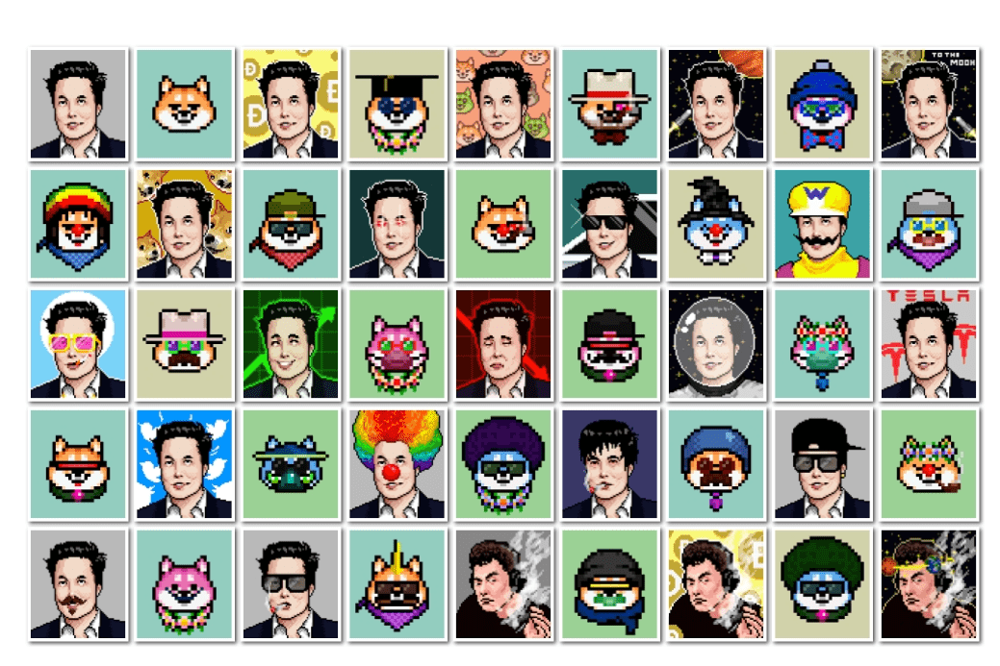

# Dogs Of Elon

The Dogs of Elon – 登月交易者的 NFT。
DoE 是我们的激情项目！我们致力于创建一个 CryptoPunks 替代品来代表我们，即 meme 硬币持有者。我们都见证了 meme 币社区的力量及其不断挑战专家的能力。为了庆祝 meme 硬币之王，我们创建了 10,000 个独特的 NFT，其中包含每个人都喜欢的 K-9，特殊的子系列包含 30 个独特的 Elons 和 70 个僵尸狗狗。
为了确保社区的安全，我们采取了额外的措施，让 CertiK 对我们的合同进行审计。 （还有多少其他 NFT 项目被审计？遗憾的是不多。）
NFT 质押作为对加密领域最强大社区的庆祝，可以质押 DoE NFT 以在短期内赚取 $renDOGE 和 $SHIBA、$DOE。 （每个存入的 NFT 将在这个限时池中占有一份）。了解配套的 $DOE 代币。
Fair Launch 发布日期将公开公布，每个参与地址最多只能领取 10,000 只 Elon 狗中的 20 只。在预售结束时，您的 NFT 及其元数据将被公开，因此每个人都有公平的机会获得一些很酷和稀有的东西。
$DOE 为生态系统提供动力的强大 ERC20。 $DOE 是一种以社区为中心的 DeFi 加密货币代币，也是 Dogs Of Elon NFT 的伴侣。可以抵押 $DOE 以被动赚取更多的 $DOE、renDOGE 和 $SHIBA
代币安全 为确保安全，我们对 $DOE 代币合约和 Dogs Of Elon NFT 合约进行了 CertiK 审计。 $DOE 合约不包含任何潜在危险代码，例如铸币函数，即供应量固定为 1,000,000,000 $DOE。此外，一旦我们将质押奖励存入池中，我们将放弃该合约的所有权，确保无法撤回奖励或修改奖励。

