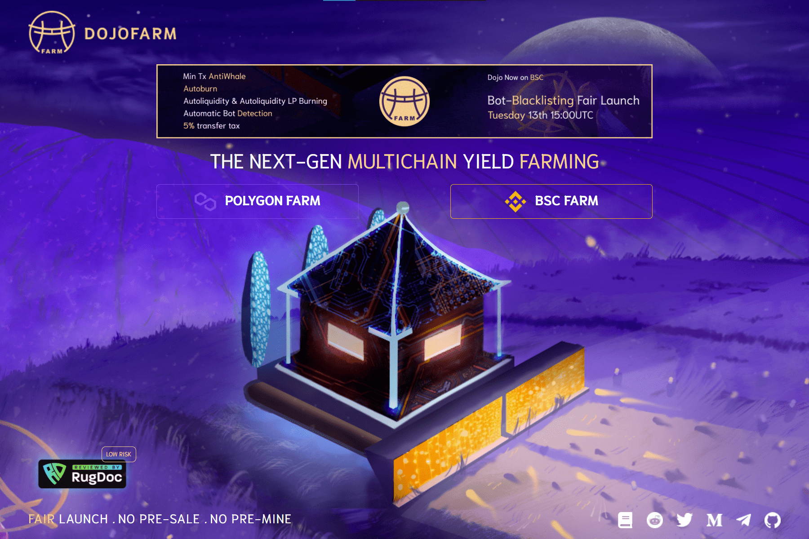

# DojoFarm Finance

DOJOFARM 是具有高年利率的下一代多链产量农业！在多边形和 BSC 上。
在审查了几种单产农业模型后，我们决定选择一种可以帮助最终用户长期获得最大收益的模型。我们是豹叉。
DOJOFARM 的所有功能都将有助于稳定价格。投资者对自动做市商平台 (AMM) 以及 DeFi 未来应用实现的潜力感到兴奋。
通货紧缩

  自动减排功能
  可持续的代币经济学
  自动唱片
  自动烧录
  反鲸
  押金重新分配
  推荐计划（5% 推荐）

萨福 100%

  初始流动性烧毁（防地毯）
  没有预售
  没有预兆
  没有预装
  没有迁移者代码
  农场开放前应用时间锁定
  新：流动性不由操作员管理！

DOJOFARM 的目标是为农民创造一个安全的地方。我们的农场和矿池将在 Polygon (Matic) 网络和 BSC 上设置不同的加密资产。

