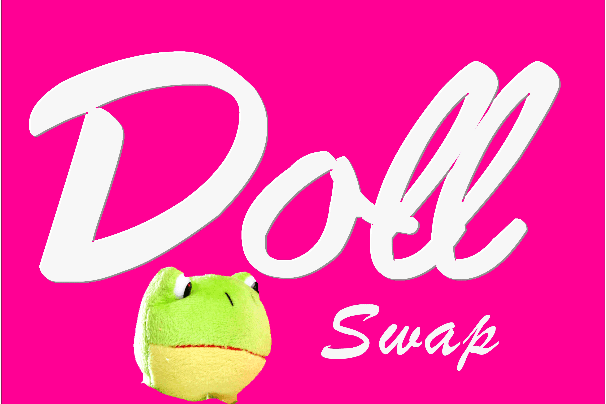

# Doll.Finance

DollSwap 从 PancakeSwap 和 Yield Farming 分叉，运行在币安智能链上的 Staking 平台。
DollSwap 由 DeFi Dolls 为 DeFi Dolls 构建。我们拥有一支由经验丰富的 Dolls 组成的专门团队，他们已经在加密领域工作了多年。 $DOLL 是我们平台的原生货币。在 DollSwap 上质押、汇集并赚取 $DOLL。
没有早期投资者，没有预耕，没有储备。 DollSwap 在 BSC 上 100% 公平发布。
我们正在结合 Defi 和 NFT 中一些最激动人心的创新。此外，我们正在为社区进行 100% 公平的发布。
您可以将 DOLL DEX 作为游戏来玩，并从中获得很多乐趣。来到娃娃世界，打造自己的世界！另外，不要忘记您的 NFT 设备！
DollSwap 允许用户交易 BEP20 代币，为交易所提供流动性并赚取手续费，质押 LP 代币赚取 DOLL，质押 DOLL 赚取更多 DOLL，质押 DOLL 赚取其他项目的代币。
DollSwap 使用自动做市商模型，这意味着没有订单簿，而是使用流动资金池。用户可以通过成为流动性提供者来赚取收入；通过将他们的代币添加到流动性池中，他们可以种植 LP 代币并质押他们的 DOLL 以获得奖励。他们还可以通过彩票和不可替代的代币来试试运气。
DollSwap 代币 DOLL 是最初在币安智能链上推出的 BEP20 代币。 DOLL 的主要功能是激励向 DollSwap 平台提供流动性。

