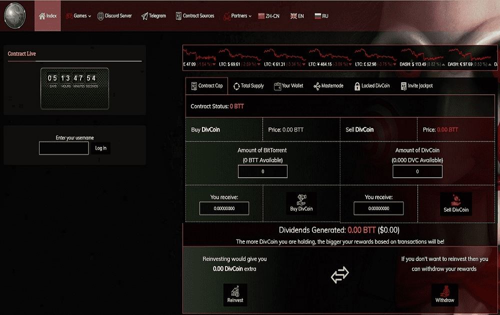

# Dollar Divs BTT DVC Exchange

注意：此处不会显示 BTT 合约价值和交易量。&nbsp;

什么是美元除法？ Dollar Divs 是一个在 TRON (TRX) 和 BitTorrent (BTT) 网络上提供游戏的平台。这些是您必须放入 TRON 或 BitTorrent 的游戏。这种加密货币都有真正的价值。永远记住，这些都是游戏，你不应该将其视为真正的投资。你可以赢得很多，但也会失去一切。交易所游戏费用 交易所游戏的入场费是您投入游戏的加密货币总量的 18%。退出费用是您提款总额的 17%。这些费用分配给所有 DivCoin (DVC) 持有者。 DVC 越多，您在费用中的份额就越大。如果有人使用您的主节点购买，您将获得基于存款金额的 18% 入场费的 33% 的保证。

