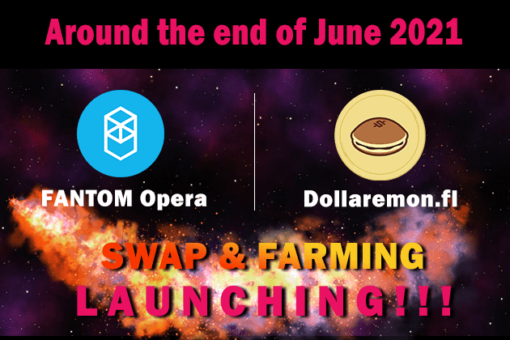

# Dollaremon

1. 与跨链兼容 确定每个代币使用的网络，例如可以在基于BSC的Binance智能链上使用的BEP20代币和可以在FANTOM上使用的FTM。因此，交换属于不同链的代币并不容易。但是有了 Doolaremon，没关系！ .. 我们计划扩展功能，以便可以连接各种链。 （FANTOM 6 月中旬，Matic 7 月中旬，AVAX 8 月中旬） 这意味着可以上市各种代币，它将是一个可供各种人使用的平台。
2. Money Pocket，Dollaremon Dollaremon独有的系统，对Money Pocket中的所有代币收取一定的费用。与其他交易所最大的不同在于，收取的费用将根据份额分配给拥有 4DP 的用户。此外，将分发的不是一种代币，而是四种代币，BUSD / BNB / cCBD / sCBD。
3. 链接CBD CASH协议，赚更多钱！ CBD CASH 协议是一种发行与 1 克实际 CBD 挂钩（=可交换）并维持价格的 cCBD 代币的协议。使用 cCBD 可换成 1g = 1cCBD 的高纯度 CBD 分离物。高纯度、高端的 CBD 隔离物成本约为 1g = 100 美元，因此 CBD 爱好者可以以低廉的价格获得 CBD。未来，我们计划开设网上商店，您可以使用 cCBD 兑换 CBD 产品。网上商店销售的 CBD 产品越多，cCBD / sCBD 将被烧掉的越多。这意味着 CBD 产品销售的越多，cCBD / sCBD 的价格就可以预期越高。您还可以通过质押 sCBD 代币获得 cCBD 作为股息（在 CBD CASH 协议中，它表示为在 Boardroom 中存款）。您不仅可以获得 cCBD 和 sCBD 作为 4DP 的红利，而且您可以预期 cCBD / CBD 的价格会随着 Dollaremon 使用量的增加而上涨，因为运营商购买 cCBD / sCBD 是有利润的。

