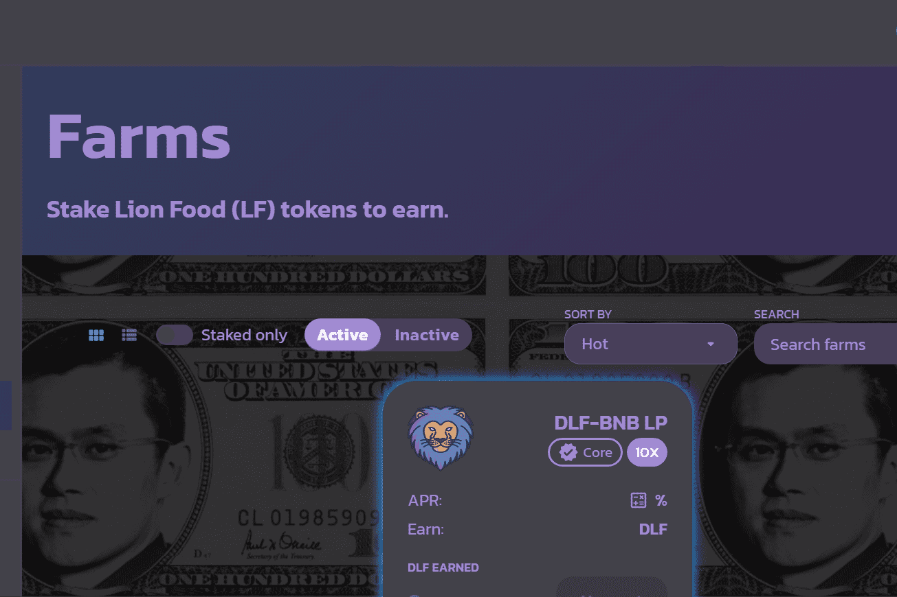

# Dollarswap

Dollarfuture 是一个跨链去中心化平台，提供去中心化交易所（Dex）、农业和流动性功能。 Dollarfuture Dex 允许用户根据提供的流动性以几乎零费用将一种代币换成另一种代币。该平台以更高效的方式满足现有市场对代币交易的需求，并提供最佳的用户体验。 Dex 还拥有彩票部分、流动性池、投票和用于启动板的 IDO 平台。
Dollarfuture 平台还拥有一个 Yield Farming 部分，允许用户通过在 DLF 平台上质押流动性来种植 DLF 代币。由于只有 500,000 个代币供应，DLF 代币的总耕作期将需要 4.5 年才能结束。这将涉及在耕作过程中将奖励减半的时期，以在其所有平台上保持和提升 DLF 代币的价值。
Dollarfuture 在其所有社交媒体平台上拥有超过 50,000 名会员。 DLF 处于一个独特的位置，可以产生不可磨灭的影响，旨在创建本地比特币 Dex。随着每天交易数十亿美元的比特币，去中心化交易所对目前使用的中心化加密交易所来说是一种令人耳目一新的欢迎。它为“成为自己的银行”这一短语赋予了新的含义，因为用户将能够在钱包里舒适地交易比特币。我们独特的区块链旨在支持旨在舒适地托管 Bitcoin Dex 的节点，并使用先进的加密系统保护其交易。
该代币将在我们所有的平台上使用，并将作为 DLF Dex 和区块链的治理代币。 DLF 代币将用于对有关区块链上的上市、流动性提供、耕作奖励和节点管理的提案进行投票。

