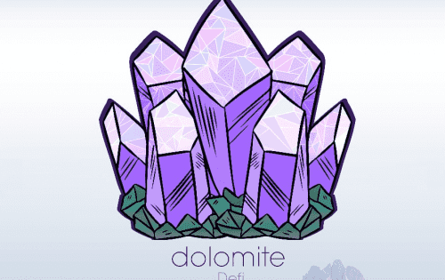

# Dolomite Defi

Dolomite Defi 是使用自动做市商 (AMM) 技术的去中心化交易所 (DEX)。该项目是 Goose Finance 的一个分支，目标是有机地成为币安智能链 (BSC) 上最有价值、最具吸引力和面向社区的项目之一。
Dolimite Defi 的目标是通过创新促进增长。我们已经建立了一支精心挑选的团队，他们在 Defi 领域拥有多年经验和良好的业绩记录。我们一直有兴趣与我们社区的专家合作，如果您想参与一些真正特别的事情，请不要犹豫与我们联系。
我们是一个集合体，我们将成为，我们一起形成 Dolomite Defi....欢迎。

