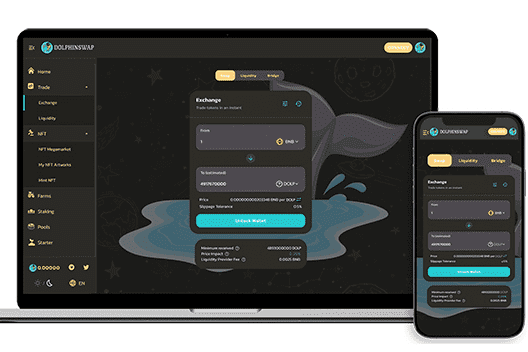

# DolphinNetwork

Dolphin Network 是一个完全去中心化的 Meme 代币 NFT 市场。
DOLP 不仅是 Meme 币，还是一个 NFT Marketplace，用户可以在其中创建 NFT meme 并在 Marketplace 上进行交易。
NFT 农场
DOLP Token 拥有一个创新的 NFT 农场，您可以在其中质押 DOLP 代币或合作伙伴代币以赚取漂亮的 NFT！当您质押您的代币时，您将获得可用于选择您想要的 NFT 的积分。随着时间的推移，将会有更多的 NFT 上传，包括来自我们合作伙伴的大量 NFT！因此，最好立即开始质押您的代币并开始赚取积分。随着我们建立新的合作伙伴关系，您还可以从您可能持有的不同币安智能链代币中赚取 NFT。我们的海豚银行为您提供各种福利
海豚交换
Dolphin Swap 是我们的官方去中心化交易所（DEX）。它使持有者能够将任何 BEP20 代币换成另一个。它由 PancakeSwap 提供支持，这是世界上最安全和最值得信赖的 DEX。此外，它是我们构建 DOLP 持有者独有的附加特性和功能的基础。
海豚 NFT 市场
Dolphin MarketPlace - 您可以在其中创建、购买和出售 meme NFT

