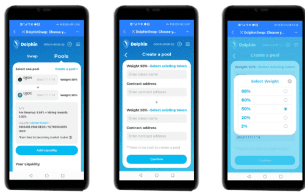

# DolphinSwap

DolphinSwap 的流动性池最多支持八种货币，并允许您自定义每种代币的比例和池的费用。它是一个通用的去中心化交易所。做市商想要得到更灵活的做市方案，他们需要更灵活的做市交易协议。 DolphinSwap 可以将 50% 的比例更改为完全自定义的比例。例如，在EOS-USDT池中，不再局限于必须以50%价值比例注入的相应代币，而是进入用户自定义比例价值的代币，如75%的EOS和25%的USDT。当然，如果用户将代币设置为两种，一种是EOS，一种是USDT，比例为1：1，那么和Uniswap-like DEX没有区别。 DolphinSwap 可以大大减少无常损失，同时增加财务灵活性。

