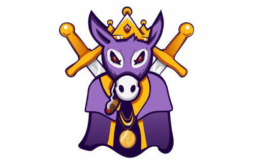

# DonkSwap

Donkey King Finance 成立于 2021 年 4 月，正值加密地毯拉动时代。目标是创建一个安全的地方来投资币安智能链（BSC）项目，同时开发一个受益于该生态系统的前进项目生态系统。
DonkSwap 是驴王金融的官方交易所。 DonkSwap 的目标是恢复对加密空间的信心，因为只有防地毯的项目才被允许上市。
DonkSwap Token 是大金财经的官方货币。 $DST 将为项目及其每个实体提供财务支持和稳定性。
Donkey King Casino 将成为 Binance Smart Chain 生态系统中的第一个此类赌场。持有 DonkSwap 上市代币的投资者将能够与持有其他合作伙伴代币的其他玩家对战。这允许玩家赢得他们可能尚未持有的代币。 Donkey King Casino 由一家游戏开发公司建造，预计将于 2022 年 3 月推出。
Donkey Mines 将允许 DonkSwap 合作伙伴代币的持有者通过质押其他代币来赚取其他代币。驴矿仍处于早期测绘阶段，因此尚未确定启动日期。早期预测是针对 2022 年第一季度，但这是待定。

