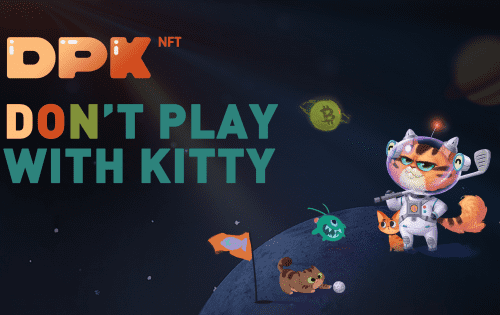

# Dontplaywithkitty

DPK 是一个去中心化的区块链游戏赚钱平台。玩家可以玩多款DPK平台推出的游戏，产生的代币可以在DPK平台的二级市场进行交易。它仅有的 7,000 个 Kreatty NFT 是使用去中心化算法生成的，是该平台游戏的唯一入口，具有最纯粹的血统，并且可以复制。后代小猫也是 NFT 并具有许多功能。平台的经济模型采用双代币模型（KIT代币和DPK代币）。 KIT代币总量有限，通货紧缩，可用于Kreatty/Kitty NFT的再生产，保障经济发展。 DPK 通证是 DAO 治理的证明，比 KIT 通证具有更高的价值。DPK 平台还提供多种游戏赚钱和 GameFi 和 DeFi 玩法，持续为用户带来新鲜愉悦的游戏体验和金融财富效应。第一款游戏宠物花园已上线，元界项目Mine Planet首批1000颗行星NFT已售罄，1月10日起玩家可派出Kreatty/kitty NFT在行星上探索获取DPK代币和KIT代币， DeFi功能将于2022年1月17日上线。第二款游戏《勇敢的世界》为大型魔幻史诗风格，2022年1月末龙之NFT盲盒预售。

