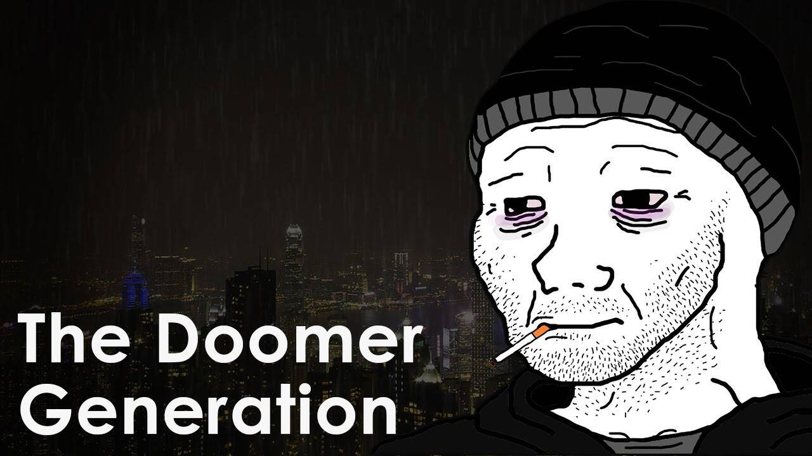

# Doomer

关于
我们的背景
我们出生在 90 年代，成长在一个科技在极短的时间内以前所未有的速度发展的时代
我们相信
生活本质上充满了无法逃避的痛苦、无意义和荒谬。我们都是潜意识生存本能的囚徒，为了维持生存而繁衍后代。
我们在做
艺术和苦行可以帮助我们克服毫无疑问的欲望和对自私的非物质欲望的追求，如性、金钱、地位等。
阿瑟·叔本华
只有一个与生俱来的错误，那就是我们存在于
为了快乐..只要我们坚持这个与生俱来的错误..世界对我们来说似乎充满了矛盾。因为在每一步，无论大小，我们都必然会体验到，世界和生活肯定不是为了维持幸福的存在而安排的……

