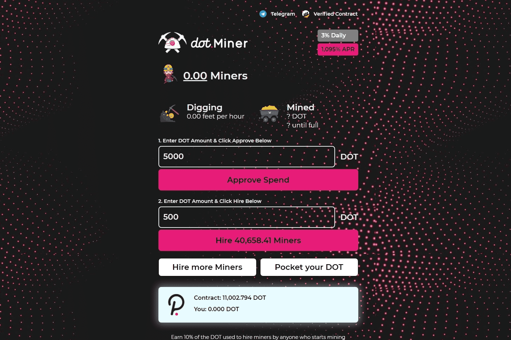

# DotMiner Finance

Cake Miner 根据当前的挖矿效率，每天支付 3%。随着您和其他玩家雇佣矿工、复合收益和口袋蛋糕，挖矿效率会上升和下降。

游戏的目的是比其他玩家更快、更频繁地雇佣更多矿工。这反过来又可以让您更快地获得更多蛋糕。使用您的每日 Cake 收入雇佣更多矿工将在 30 天或更短的时间内将您的矿工增加 3 倍。

不像它的前辈每天支付 100%，导致即时和大规模的通货膨胀。 Cake Miner 每天支付 3% 的适度费用，让投资者高枕无忧，因为他们知道他们的投资具有无限的增长潜力，并且最大的、不可能的风险低于 3%。

