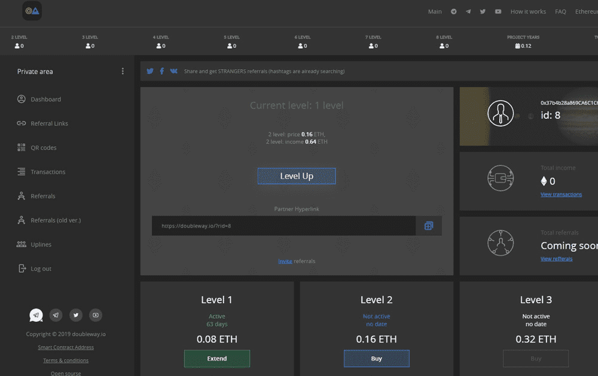

# DoubleWay

Doubleway 它是基于开放智能合约以太坊的二进制开放传销结构。 DoubleWay - CryptoHands 项目的二进制插件，它是一个独立项目，可实现最大程度的去中心化。 DoubleWay 是 CryptoHands 的阴暗面，具有已经预先构建的结构。无穷大的结构。

Doubleway MLM 克隆脚本
Doubleway克隆脚本是一个以太坊智能合约MLM克隆脚本，可以帮助你启动像Doubleway一样的合法加密货币MLM。在bitdeal你可以获得双向传销克隆脚本，这是一个传销网站脚本，可以在以太坊智能合约的控制下运行。一旦网站上线，智能合约就无法更改。因此，它是 100% 防黑客和快速执行的脚本。该脚本确保每个用户的加密收益和资金交易是完全去中心化的，因此无需手动控制来调节交易和其他操作。

