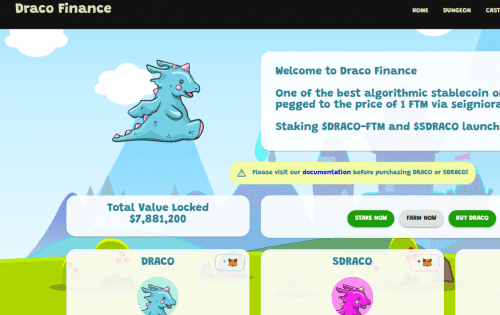

# Draco.Finance

Fantom Opera 上最好的算法稳定币之一，通过铸币税与 1 FTM 的价格挂钩。墓叉。
放弃所有权。Fantom Opera 上最好的算法稳定币之一，通过铸币税与 1 FTM 的价格挂钩。

我们是 Draco Finance，一种算法稳定币，目前与 1 $FTM 的价值挂钩。算法稳定币（ASC）是一种无抵押稳定币，专为提高价格稳定性而设计。算法稳定币的美妙之处在于，它们比抵押的表亲更具资本效率。 Draco Finance 将凭借其经验丰富的团队合作来扩展这种资本高效算法稳定币的理念，并在之前的迭代基础上扩展生态系统的基础。
Draco Finance 的全部重点是构建一个真正的跨链算法稳定币协议，该协议通过 DeFi 生态系统中的真实用例来稳定。

