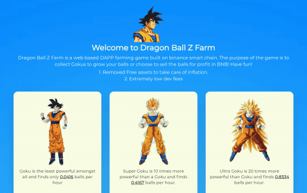

# Dragon Ball Z Farm

BSC链上的空闲矿工游戏
购买 Gokus，生成球并出售 BNBDragon Ball Z Farm 是一个位于 BSC 的 dApp。该平台是一款休闲游戏。这意味着，您可以被动地玩游戏并获得奖励。你的目标是购买悟空，并产生能量球。然后，您可以出售它们以获取利润（BNB 硬币）。龙珠Z农场dApp分析
触手可及的最重要的龙珠 Z 农场 dApp 指标 - 分析下面的深度图表，评估 dApp 在不同时间段的活动并做出快速、准确的决策！

