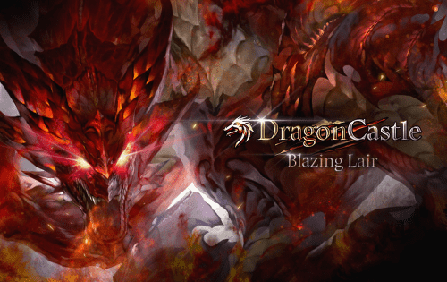

# Dragon Castle

Dragon Castle(DC)是一款区块链DApp游戏，使用TRX击败怪物并获得奖励。通过玩龙城，用户可以获得TRX和DC代币作为奖励。用户可以冻结 DC 代币以从用户奖励池中获得每日 TRX 奖励。 DC 代币将在 SkyPeople 开发的未来区块链游戏中以多种方式使用。***Dragon Castle***[是一款受麻将纸牌](https://boardgamegeek.com/boardgame/67948/mahjong-solitaire)自由启发的。在您的回合中，您从中央“城堡”（称为龙城堡）中取出一对相同的瓷砖并将它们放置在您自己的领域板上以建造您自己的城堡。有时，您可能会牺牲这些瓷砖来获得神龛。

每次您创建一组相同类型的图块时，您都会“合并”它们，即将它们正面朝下翻转以得分。当您合并一组时，您还可以在合并的图块上建造神殿：神殿可以让您获得更多积分，但它们也限制了您的建筑选择。您还可以利用可用的精神卡及其改变游戏规则的力量……但这需要付出代价！最后，别忘了查看游戏中的龙卡，并按照建筑要求获得奖励积分。

当龙城被降到只有一层时，就会触发游戏结束。最后一轮过后，得分最高的玩家就是新龙堡的领主……也是游戏的胜利者！

