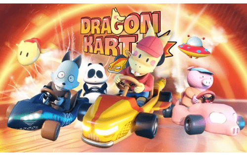

# Dragon Kart

Dragon Kart 是一款建立在区块链平台上的 3D 赛车电竞游戏，游戏中的角色取材于越南知名艺术家 Thang Fly 的皮卡龙系列。玩家可以参加戏剧性的比赛，并利用他们卓越的驾驶技术从来之不易的胜利中获得各种奖励和代币。第一款由社区启发、建造和拥有的基于技能的 3D 赛车战斗游戏。
$KART 是一种功能性的多用途代币，将用作 Dragon Kart 参与者之间以去中心化的方式进行交换的媒介。

