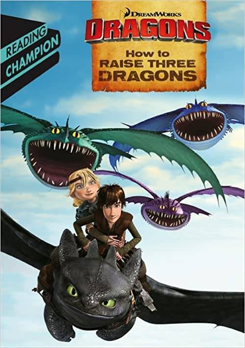

# Dragon Raise

DragonRaise Game 是一款去中心化的金融游戏
Binance 智能链中的工具，允许两者
被动和主动投资者赚钱。开始制作
钱，你需要注册。之后，您可以购买一个
龙，直到它死去都会获利。
游戏规则
- 项目注册价格为0.025 BNB

- 龙的等级越高，价值越大

- 只有在之前的龙处于活动状态时才能购买更昂贵的龙

- 龙有三条命，每条命你都会收到相当于 74% 的报酬
  龙的代价。当龙的生命结束时，他死了，没有利润

- 你可以在他死前或死后购买更多的龙生命。三款新品价格
  一条生命等于一条龙的价格
  会员计划
  10 行 = 24%
  会员奖励仅来自活跃
  龙。如果你的龙没有激活，那么
  奖励将记入第一个
  你上方的玩家有一条活跃的龙
  安全
  该游戏以智能合约的形式在
  BSC 网络。资金不会存储在智能合约中，
  所有流入的资金流将立即分配
  用户之间按照游戏规则。这
  与智能合约交互的接口是
  网站，但它也消除了 DDoS 攻击的问题，
  因为“数据服务器”的角色是由
  币安智能链和静态文件分布在
  CDN 网络。

  
