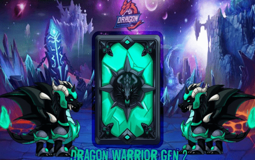

# Dragon Warrior

Dragon Warrior 游戏的灵感来自“如何训练你的龙”系列。通过游戏环境，我们想向您讲述 DRAGON 岛人民与龙之间寻求和平的激动人心的战斗。故事开始于多年前的龙岛，人与龙和平共处。当一个名叫所罗门的黑巫师带着他的三条恶龙来毒害岛上的龙时，问题就出现了。龙变得凶猛，袭击了岛上的人们。人们必须反击并找到摧毁所罗门的方法。在战争中，战士们决心找到治愈方法并成功了。药水只能用被打败的巨龙之血制成。药水制作成功后，武士就可以用它们驯服巨龙了。然后，他们将在即将到来的战斗中站在战士的身边。玩家将扮演战士的角色，参与激烈的战斗，击败所罗门，为岛上带来和平。
Dragon Warrior 是一款建立在 Binance 智能链之上的赚取 NFT 游戏，让玩家可以完全控制他们的数字资产，参与愉快的游戏环境。玩家可以使用他们的战士在战斗模式中与龙战斗或在训练模式中与其他战士战斗以获得 GON 令牌。此外，玩家还可以在战斗中驯服巨龙，获得巨龙NFT。 Warrior NFT 和 Dragon NFT 都是按照 ERC-721 标准铸造的，可以在各自的 NFT 市场上自由交易

