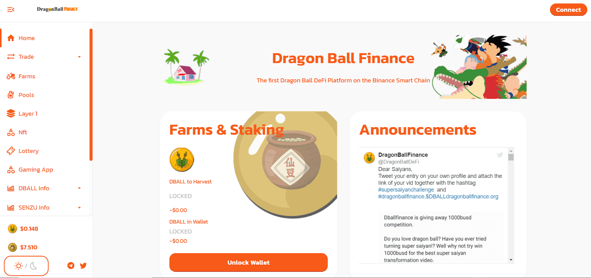

# DragonBall Finance

DragonBallFinance 是币安智能链网络上第一个完全去中心化、自给自足的一体化 defi 平台，在当前无聊的美食名称 defi 世界中带来了龙珠主题。
DragonBallFinance 将实施多种产品和机制，即使从长远来看，也能确保项目的可持续性。
DragonBallFinance 回购燃烧功能：
质押时将收取 3% 的保证金。
取消质押时将收取2％的提款费。
费用明细
50% 将用于每周烧伤
50%为项目的产品资金。
5% 的铸造代币用于应急和发展基金

