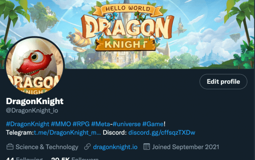

# DragonKnight

龙骑士是 BSC 上的 MMO RPG Metaverse 游戏。与传统MMO RPG游戏相比，《龙骑士》除了多人在线角色扮演的功能外，还为游戏增加了区块链游戏最流行的特色——即玩即赚。玩家既可以沉浸在在线角色扮演中，又可以同时获得经济收入——这是未来吸引更多游戏玩家的关键机制。
除了play-to-earn模式外，龙骑士开创了跨游戏资产争夺GameFi的先河，两场游戏中的资产可以互联互通，玩家可以在龙骑士中体验前所未有的场景。它实现了迄今为止游戏行业尚未出现的场景。比如魔兽世界和英雄联盟的角色是不可能正常完成的，但是对于玩家和未来游戏的发展来说，这显然阻碍了游戏的发展。但现在有了区块链，这一切都在悄然发生变化。在龙骑士中，您可以体验多种游戏。这不仅是游戏技术的创新，

