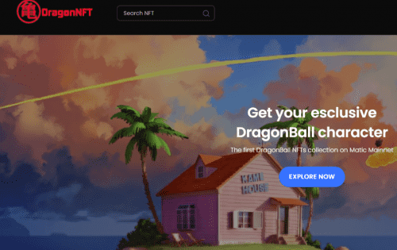

# DragonNFT

DragonNFT：Matic 主网上的第一个 DragonBall NFT 集合 DragonNFT 使用 NFTify 平台，我们很自豪能够率先在 NFTify 平台上推出 DragonBall 角色集合。 DragonNFT 市场支持 Matic 主网，因此所有 DragonNFT 集合都在 Polygon 区块链上。我们的 NFT 根据它们在系列中的作用分为稀有级别：

  常见的
  稀有的
  EPIC 稀有度越高，铸造的副本越少，价格越高

收藏发布图：
该系列将分 3 个不同的水滴发布，每个水滴包含 8 到 10 个不同稀有度的角色。
（如果一滴稀有字符的数量比普通字符的数量多，那就没有意义了，他们的铸造副本仍然更少）
为了保持作品的排他性及其价值，每一滴水都没有第二次发布。
但是，所有者将始终能够在 OpenSea 等市场上转售它们。
将为每种稀有度铸造的副本是：

  10份公地
  稀有3份
  史诗副本1份

删除日期

  第一滴（10 个字符）

2022 年 11 月 1 日

  第二次下降（？？字符）

2022 年 11 月 3 日

  第三滴（??字符）

2022 年 11 月 5 日

