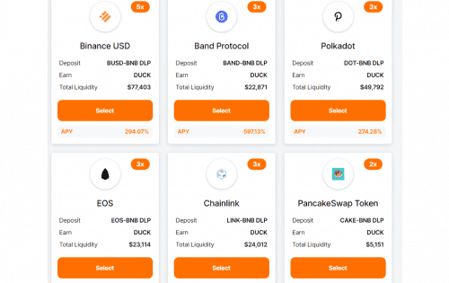

# DrakeSwap

DrakeSwap 是币安智能链（BSC）上的去中心化 AMM（自动做市商）协议。
DUCK & SWAN 代币是平台的原生 BEP-20 治理代币。用户可以通过在 DrakeSwap 上提供流动性来赚取 DUCK 代币，质押的 DUCK 可以赚取 SWAN。为了在社交媒体上向加密资产的贡献者致敬，DeGate 提供了以优惠价格购买 DG 代币的早期机会。
1000 万个 DG 代币，0.005 美元

