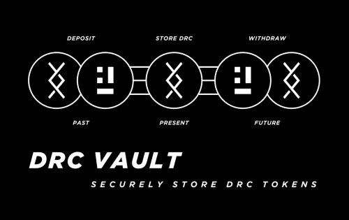

# DRC Vault

DRC Vault 是专为 DRC 持有者创建的安全非托管和 100% 去中心化应用程序。在 DRC Vault 中持有的 DRC 代币完全由用户控制和拥有，其他任何人都无法访问这些资金。
DRC Vault 具有直观的界面，允许轻松存取款、排行榜和业绩统计。将来，DRC Vault 用户可能会获得额外的好处。DRC Vault 是专为 DRC 持有者创建的安全非托管和 100% 去中心化应用程序。在 DRC Vault 中持有的 DRC 代币完全由用户控制和拥有，其他任何人都无法访问这些资金。
DRC Vault 具有直观的界面，允许轻松存取款、排行榜和业绩统计。将来，DRC Vault 用户可能会获得额外的好处。

