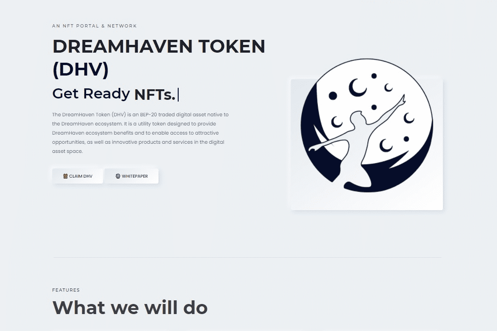

# DreamHaven

DreamHaven 代币 (DHV) 是 DreamHaven 生态系统原生的 BEP-20 交易数字资产。它是一种实用型代币，旨在提供 DreamHaven 生态系统的利益，并能够获得有吸引力的机会，以及数字资产领域的创新产品和服务。
DHV 持有者可以在 DreamHaven 交易所获得各种生态系统福利，例如提高他们存入 DreamHaven 钱包的数字资产所赚取的奖金，以及降低 DreamHaven 交易所的费用。

除了通过锁定在我们的 DreamLock 计划中的数字资产获得额外奖励外，DHV 持有者很快将能够参与 DreamLaunch 等奖励计划，在那里他们可以获得新的代币作为奖励。
除了DreamHaven生态系统的好处和机会，在DreamHaven的支付计划DreamSpend下，用户不仅可以使用二维码与商户合作伙伴进行DHV电子支付，还可以使用DreamSpend下发行的DreamHaven卡在支付时获得诱人的奖励在DHV。
此外，用户可以使用 DHV 兑换限量版产品，并在我们新推出的生活方式平台 DreamWorld 上获得独家体验。未来，用户还可以在 DreamWorld 平台上购买和交易与我们的合作伙伴一起策划的 NFT 收藏品。

