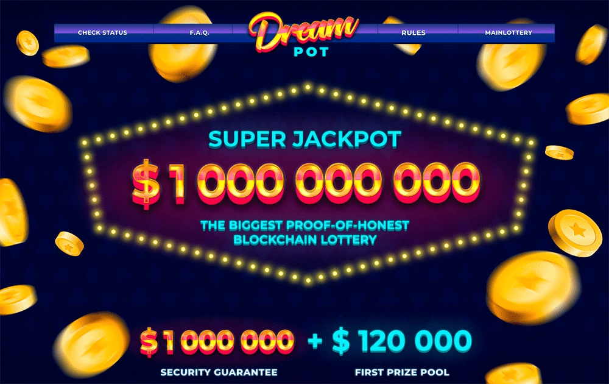

# DreamPot

DreamPot 是一种完全合规的基于区块链的彩票，使用具有最大奖池的加密货币 - 1 000 000 000 美元。以太智能合约保证彩票的公平性。 Oraclize (http://www.oraclize.it/) 保证 RNG 的公平性。主要的加密货币是以太币，但用户可以通过 Changelly 系统（https://changelly.com/）在他们的账户中将 100 多种加密货币和山寨币兑换成 ETH。Dreampot，一个电子商务应用程序，引入了一种新的和智能的购物方式！解锁大量折扣并拥有您想要的产品或以市场价值的 1% 前往您梦想的目的地！

