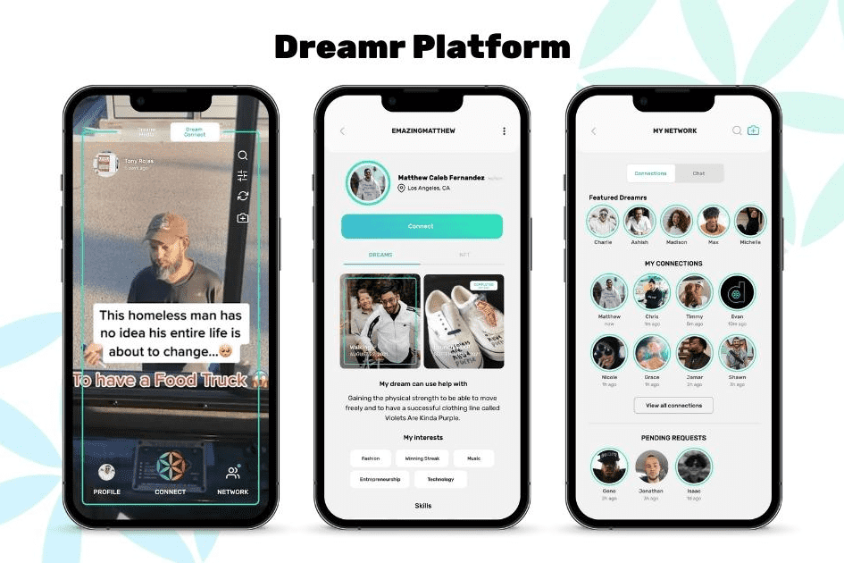

# Dreamr

Dreamr 是一款与 web3 集成的混合移动应用程序，供人们追求梦想。 Dreamr 利用社区建设功能、DeFi 和 p2p 市场为平台用户提供实现任何梦想的资源和工具！ Dreamr 通过 $DMR 代币为用户提供平台治理方面的决定性发言权，其中 33% 的供应通过奖励分配给社区。
Dreamr 生态系统包括一个由组织组成的集团，这些组织和谐地工作，围绕以下核心前提构建创新技术产品并制作高质量的励志内容；

  目标成就心理学，
  团结胜过分离，以及
  用科技将梦想付诸实践

Dreamr 的生态系统包括数字资产、技术产品和物理组件，例如 The Dream Machine Tour，它利用平台的社区来制作现实世界的活动和媒体。
Dreamr 的核心理念是首先交付其社区价值，并利用回馈作为一种实用模式，通过其慈善机构 Dream Machine Foundation 创造生态系统价值。迄今为止，Dream Universe 社区已为梦想贡献了超过 2,500,000 美元。
访问 dreamuniverse.org 了解更多信息

