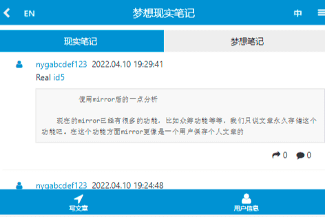

# DreamRealNotes

&nbsp;&nbsp;&nbsp;&nbsp;梦想现实笔记DApp，Web3.0社交应用，用户发布的文章内容可以永久存储在区块链的区块之中，用户可以记录现实和梦想。

&nbsp;&nbsp;&nbsp;&nbsp;本DApp系统拥有和微博推特相似的社交功能，用户可以发布文章、回复、转发文章、创建个人资料、关注其他用户等等。

&nbsp;&nbsp;&nbsp;&nbsp;用户发布的文章也可以理解为一个一个互不相同的NFT。

&nbsp;&nbsp;&nbsp;&nbsp;简要概括：

&nbsp;&nbsp;&nbsp;&nbsp;微博推特的社交功能 + Mirror的文章永久存储功能 = 本DApp

&nbsp;&nbsp;&nbsp;&nbsp;本DApp系统目前已经实现了将任意长度的文章内容存储在ETH公链的区块之中。文章的目录数据存储在EOS公链的智能合约之中。

&nbsp;&nbsp;&nbsp;&nbsp;因此目前的本DApp系统需要同时联合使用ETH公链和EOS公链，ETH公链的区块负责存储文章内容，EOS公链的智能合约负责存储文章目录。

&nbsp;&nbsp;&nbsp;&nbsp;使用手机钱包App访问本DApp系统，只能浏览、查看文章，不能进行其他操作。因为现有的手机钱包App不可以同时在两个区块链上进行操作。

&nbsp;&nbsp;&nbsp;&nbsp;为了使用本DApp系统的完整功能，建议使用个人电脑，谷歌浏览器，Scatter，MetaMask。

&nbsp;&nbsp;&nbsp;&nbsp;在未来的几个月，将实现以下功能：

&nbsp;&nbsp;&nbsp;&nbsp;1. 增加对Arweave的支持，用户可以选择将文章或者图片存储进Arweave区块链。

&nbsp;&nbsp;&nbsp;&nbsp;2. 实现对文章、回复进行点赞、打赏的功能。

&nbsp;&nbsp;&nbsp;&nbsp;3. 为本DApp系统的用户发行NFT。

