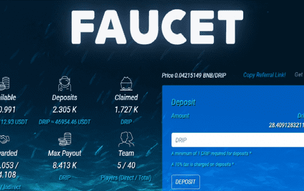

# DRIP

DRIP Network 的 Faucet 是一种低风险、高回报的合约，其运作方式类似于高收益存款证，每天支付 1% 的投资回报率，最高可达 365%。玩家可以通过存款、补充（复合）奖励以及基于团队的推荐来复合和扩大他们的收入。
DRIP 旨在奖励持有者并以税收惩罚卖家。税收用于奖励，而不是通货膨胀，这有助于支撑价格。
注意：水龙头已锁定并锁定了 83% 的供应量！
DRIP 还有一种称为 Reservoir 的单产农业解决方案。
The Reservoir 是 The DRIP Network 的解决方案，适用于希望通过向 DRIP（与 BNB 配对）增加流动性来从非通胀收益农业中受益的玩家。水库也有税收来奖励持有者，并通过锁定提高价格下限。
喷泉
Fountain 是一个专有的 DEX，购买原生代币 DRIP 是免税的。
团队空投（反倾销）
DRIP 提供团队空投功能，允许 DRIP 成员奖励他们的团队。奖励会自动质押并锁定以防止倾销。
DRIP 也可以在 Pancake Swap 上买卖。 DRIP 流动性可以质押在合作伙伴农场以获得更多回报。

