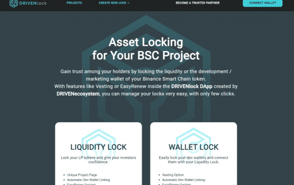

# DRIVENlock

介绍
DRIVENlock 是我们不断增长的开发工具套件中的最新产品。使用 DRIVENlock，开发者可以通过锁定币安智能链代币的流动性或开发/营销钱包来获得持有者的信任。
特征
什么是归属？
归属是初创公司经常与公司中的期权一起使用的一种策略。团队成员可能会以特定的估值获得一定数量的期权，但直到经过特定的时间后，他们才拥有这些期权。通常，这些都是在所谓的“归属时间表”上完成的，其中百分比将在某些日历日期释放。一个例子是在你开始之日收到一家公司的 1,000 个期权，然后在 2 年你拥有总数的 50%（500 个期权），在 3 年你拥有额外的 25%（250 个期权），并且在结束时第 4 年，您将拥有剩余的 25%。
为什么要使用归属？
加密货币领域的归属与启动领域的用例不同。在加密货币中，在归属时间表上拥有团队钱包可以向投资者表明团队打算让该项目长期存在，因为完全归属通常符合团队成员的最佳利益。这也限制了团队可以从这些特定钱包中进行的销售量。
什么是容易更新？
EasyRenew 是一种快速锁定选项，您只需在完成锁定后启动新锁定。如果您打算从已完成的锁中使用相同数量的令牌启动锁，而不是通过多步骤过程，您只需单击几下即可执行此操作，从而节省您的时间、汽油费和任何不必要的额外费用脚步。

