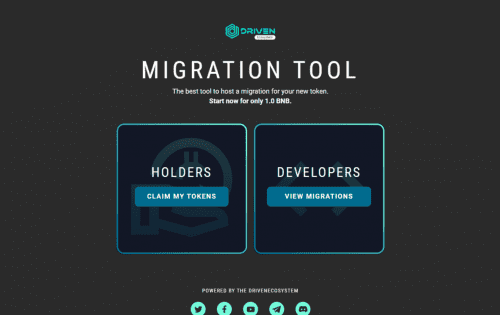

# DRIVENmigrate

关于 DRIVENmigrate dApp
DRIVENteam 最近完成了从 DRIVENx 1.0 合约到 2.0 版本的迁移，因此我们了解进行这种转换有多么困难。
这个空间非常动态，需要对合同进行一些修改。目前，他们唯一的答案是将所有持有者的资产从一个合同转移到另一个合同，这需要开发人员进行大量的努力和规划。
我们在这里通过在加密空间中实施 DRIVENmigrate 平台，让持有者和开发者的流程尽可能简单。
描述
DRIVENmigrate 是一个可在 PC 和移动设备上使用的 Web 应用程序。 DRIVENmigrate 旨在帮助开发人员、项目所有者及其投资者通过几个简单的步骤从旧的代币智能合约迁移到新的智能合约。
技术
DRIVENmigrate 由 DRIVENecosystem 开发团队开发，他们将 Solidity 用于智能合约，React.js 用于应用程序的界面，并使用 Web3 将智能合约的功能与 Web 界面相结合

