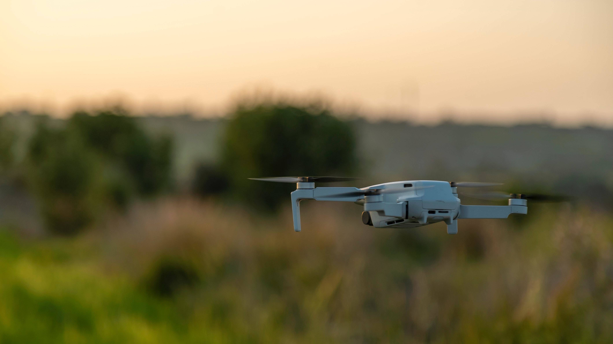

# Drones

2180 年。人类从巨大陨石坠落的后果中幸存下来……幸存者现在正在为极其有限的资源而战，躲在军事基地和掩体中。这场战斗的主要工具是无人机——侦察和战斗。玩家被邀请成为其中一个军事基地的负责人。主要任务包括购买无人机和提取奖金。世界再大，亦能盡收眼底。 DJI 航拍無人機性能強大，操作簡單，讓你換個角度發現生活的另類精彩。 類型多樣，各有所長的 DJI 航拍機，究竟哪一款更適合我？別擔心，無論你是航拍新人還是資深飛手，都能在此找到所需

