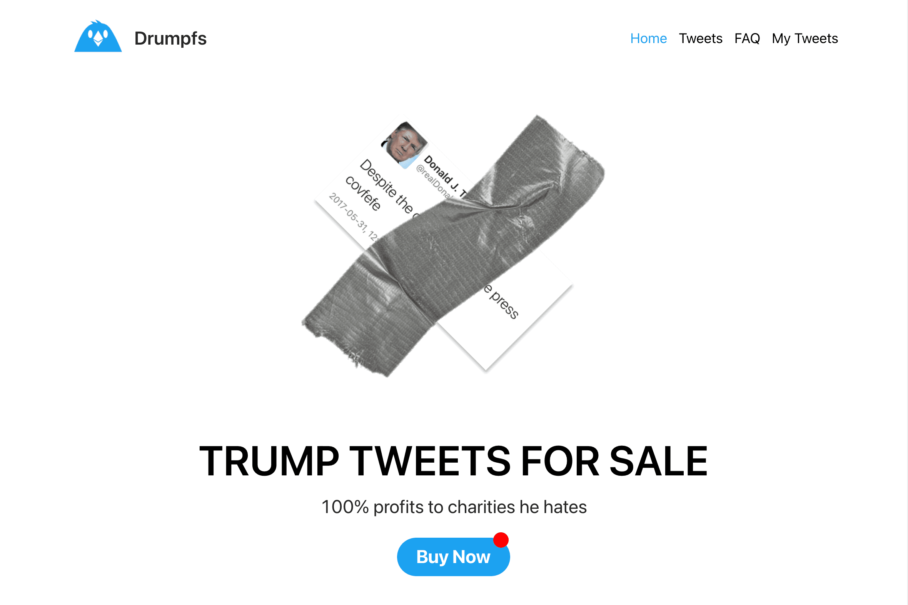

# Drumpfs

多年来，特朗普的推特账户已被暂停，此前发布的可恶、无知的推文。
有趣的是，由于他不能再发推文，他过去的推文已经成为一种有限的商品。
因此，我们决定“复兴”这位曾两次被弹劾的总统的旧推文，并将其作为 NFT 出售，以及神经网络创造的独特艺术品。我们还将这些销售的所有利润捐赠给定制慈善机构。例如，如果特朗普的推文攻击亚裔美国人，那么这笔交易的钱将用于亚洲心理健康集体。
大多数推文的价格为 0.0232 ETH，而 100 条推文的价格为 4.5 ETH。这些“臭名昭著的推文”是 100 条最具标志性的特朗普推文——具有历史意义和喜剧效果。
简而言之，我们寻求从第 45 任总统的推文这一可怕的、可怕的混乱中做出一些好事。

