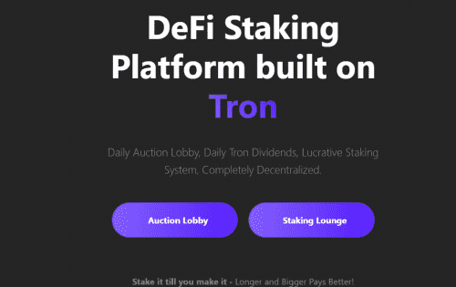

# DSP Token

DSP 是一个利润丰厚的 Staking Dapp 平台。 DSP 是从以前的质押平台背后的理念发展而来的，设计时考虑到一件事，即 STAKERS。通过拥有 DSP 代币并在我们的质押门户中质押，用户将获得其 DSP 代币的每日利息以及每天进入拍卖大厅的 DSP 总量的百分比。

**DSP Token dApp 是基于****Tron**协议构建的**DeFi**类别的加密资产。现在，根据用户数量，它在一般 dApp 排名中排名**第 8138**位，在**DeFi类别中****排名第 1916**位，这让您可以很好地了解**DSP Token** dApp 在其竞争对手中的表现。

通过分析过去 30 天窗口中的 DSP Token dApp 数据，很明显 dApp 的Balance**为**$ **4.7K**，而Volume**看跌****$** **0.00**。**DSP 代币**在 30 天内产生了**3 笔交易**，**跌幅为 -91.89%**。显然，与之前的 7 天相比，**成交量****稳定**了**0% 。**最近 7 天的数据显示，DSP Token**用户基数**为**3**，**稳定**了**0%**。

我们还建议查看**DSP 代币活动概览**和智能合约余额图表，了解这些重要指标如何随时间**波动**和变化。

