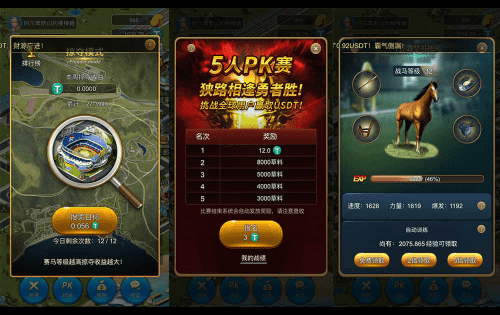

# DT Jockey Club

DT Jockey Club 是全球首款创新型区块链虚拟赛马养成类游戏，同时是一个基于DT 公链的体育竞技游戏平台。DT Jockey Club结合了区块链公开透明和不可篡改的特点, 提升了竞技游戏行业的透明度和公平性, 保障每一位用户的资金安全和用户体验, 真正做到公平公正, 以用户为核心。DT（DT Jockey Club）是基于DT公链发行的去中心化区块链数字资产，既是DT公链生态权益的代表，也是DT平台代币和平台分红权益。作为社区化区块链游戏平台DT Jockey Club的权益代表，DT的发行总量4.2亿，并通过游戏即挖矿机制来完成DT的释放。

DT持有者拥有参与DT Jockey Club平台收入分红分配、股份工资分红、社区管理等一系列权益，可以共享平台的长期发展红利。随着DT公链主网的上线及大规模投入应用，DT将引领通证经济生态的发展，并立志成为该领域的权益通证及核心代表。

DT是由DT Jockey Club平台发行的通证代币，用于实现平台内价值的交互流通。DT核心团队将全力构造一个以DT为核心的交易生态，追求平台分布式自治公平与公正的生态体系。

