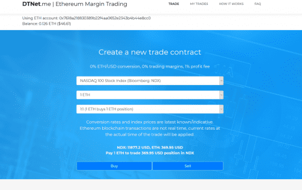

# DTNet.me

DTNet 代表“去中心化交易网络”。它是一个保证金交易平台，交易在匿名同行之间通过以太坊区块链网络进行，无需银行、经纪人或其他中介。这项研究还没有经过同行审查，重点关注了几个特定于以太坊网络的特性，这些特性总体上比比特币(Bitcoin)等竞争对手更容易追踪。

研究人员指出，以太坊的账户模型与比特币的未使用交易输出(Unspent Transaction Output, UTXO)模型形成对比，由于钱包的重复使用，该模型的私密性已经降低：

基于账户的模型加强了协议层的地址重用。从隐私的角度来看，这种行为实际上使得基于账户的加密货币不如基于utx的加密货币。

