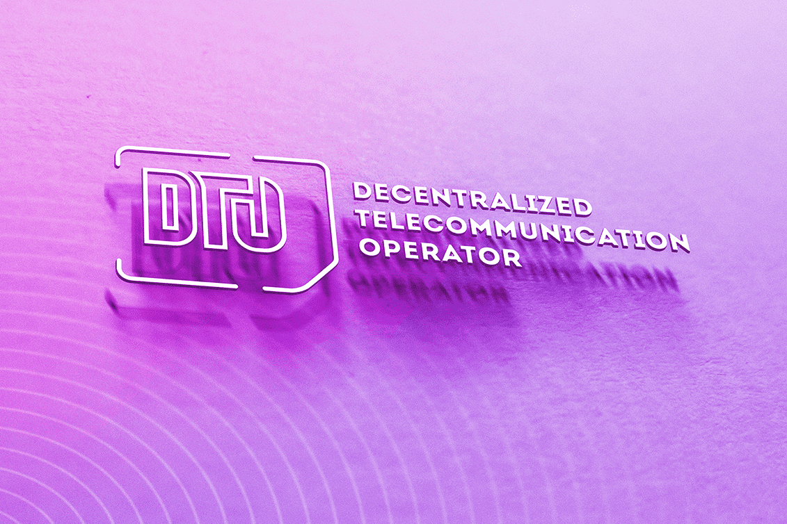

# DTO.Tech

分散式电信运营商 (DTO) — 基于以太坊区块链的分布式、开放和可扩展的编号系统。
DTO 的工作是匹配数字组合，例如 DTO1234567890，以及机器可读的标识符，例如以太坊地址和元数据。 DTO 与普通电话号码的用途相同，是一种电话号码前缀服务，但由于以太坊区块链的特性和限制，它具有明显不同的架构。与电话号码类似，DTO在（前缀）+（电话号码）被叫号码范围系统中运行，同时，前缀所有者完全控制号码范围定价。
DTO 电话前缀使用不可替代的令牌来提供唯一标识符。您将能够通过转让或出售您的 NFT 来买卖电话号码。钱包地址和其他信息带有一个代币，持有者可以完全控制它。大写前缀，例如 DTO，属于名为 Registrar 的智能合约，它控制数字范围的创建。

