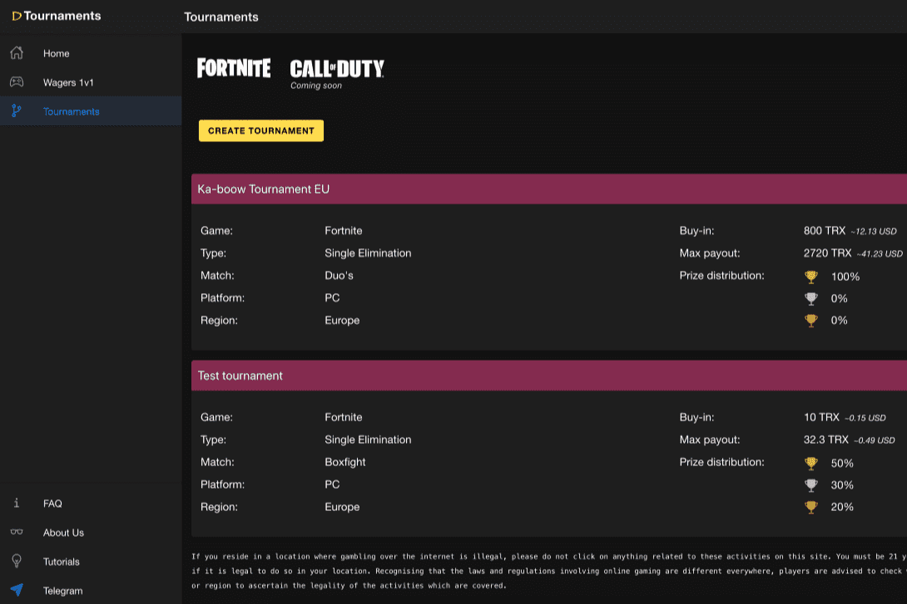

# DTournaments

DTournaments 是在 TRON 区块链上使用智能合约的下一代去中心化锦标赛平台，全自动去中心化赛事平台，我们的目标是为各种在线多人游戏和大逃杀游戏提供锦标赛。DTournaments 是一个由 TRON 驱动的项目。这是一个自动化的锦标赛安排平台。 dApp旨在吸引不同类型的多人在线游戏。通过这种方式，这些游戏将在 DTournaments 上举办他们所有的锦标赛和锦标赛。由于它是基于区块链的，该平台将提供可扩展性和透明度。

