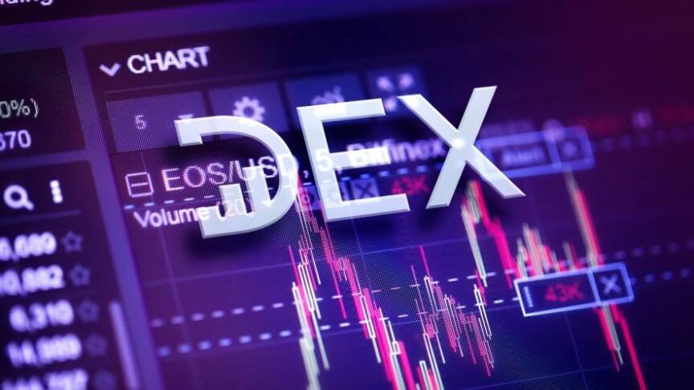

# DubiEx

DubiEx 是一个完全去中心化的交易所，其独特之处在于其真正无需信任的点对点性质和独特的功能，例如零费用交易、简单和用户友好的用户界面以及简单和免费的代币创建。 DubiEx 由志愿者和活动家经营，最大的优势在于它不是为了盈利而维护的，而是为了帮助推进加密货币对世界产生积极影响的方式。这就是 DubiEx 能够开发特定功能并追求去中心化的原因，而在其他交易所，这将削弱他们维持其商业模式的能力。用户可以直接从他们自己的以太坊钱包中将任何代币换成任何其他代币，无需存款。 DubiEx 支持限价单和市价单，以及一次完成和取消多笔交易，以节省额外的 gas 成本。通过提供简单和高级的模式，DubiEx 可供高级交易者和新手使用。

