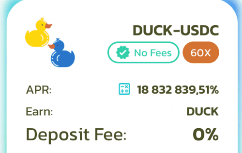

# Duck Farm

Duck Farm，基于 Polygon 的上一代单产农业。不到十年前，我们已经看到新颖的加密空间重塑了我们所知道的一切。现在，我们都即将意识到去中心化金融（或简称 DeFi 去中心化金融（DeFi）采用区块链的去中心化概念并将其应用于金融世界。构建......）成为主流，其应用在加密世界。随着 DeFi 的总价值锁定 (TVL) 激增 40 亿美元，这个生态系统的发展是可行的。当然，DeFi 或加密货币是不稳定的，但它也为公众带来了更多机会。 

结果呢？引入了更多 DeFi 项目，以维持和改造在没有中介的透明协议上运行的传统金融产品。这正是去中心化交易、保险、借贷和借贷催生新现象——高产农业的原因。

