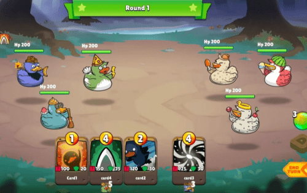

# Duckie Land

Duckie Land 是一款运行在区块链上的元界多平台（PC、Android、IOS 和 VR）多人在线游戏，每个 Duckie 都是不可替代的代币或 NFT。数以百万计的人可以参与 NFT 世界并通过熟练的游戏玩法和对生态系统的贡献获得奖励代币。
Duckie Land 的灵感来自对每一个鸭子表情包、鸭子表情符号、鸭子角色以及关于鸭子的一切的热爱。在小鸭的土地上，玩家可以收集、战斗、耕种、制作，成为小鸭领主。
Duckie Land 让游戏玩家拥有游戏内资产的所有权，并允许他们通过积极玩游戏来增加自己的价值。通过参与游戏内经济，玩家将获得奖励，并为其他玩家和生态系统创造更多价值。这些数字资产的回报是在区块链上标记化的加密货币和游戏内资源，这可能成为许多人的新收入来源

