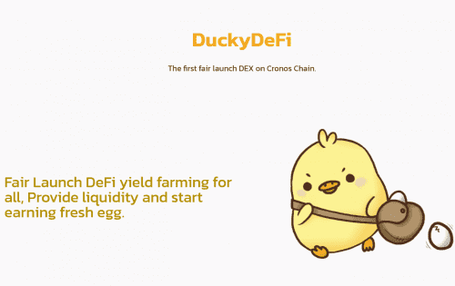

# DuckyDeFi

Fair 为所有人推出 DeFi 收益农业，提供流动性并开始赚取新鲜鸡蛋。

- 388 个独特的零代在 14 小时左右下降。

- 每只鸭子 458 CRO。 **（如果你知道为什么选择 458）**

- 每笔交易最多3 mint *（您可以使用多个帐户点击）*如果您认为自己很快！

- DEGG 将成为繁殖、制作等的主要代币

  截至今天，最后报告的 DEGG 价格未知。 DuckyDefi 的最后一个市值是未知的。 24 小时 DEGG 体积未知。它的市值排名未知。 DuckyDefi 在 0 个交易所交易。在过去的一天中，DuckyDefi 的透明交易量为 0%。

  请回顾您作为 DuckyDefi 用户或投资者的经验。我们特别感兴趣：

  实际用例
  资产安全性和冷热存储选项（包括您首选的硬件、移动和桌面钱包）
  交易时间和费用
  容易（或困难）获得资产
  投资者经验
  对未来价格走势的思考
  机构场外交易柜台、托管和银行业务选项
  注意：请不要链接到外部 URL、宣传其他资产或欺骗其他加密资产，因为这些评论会被标记。

