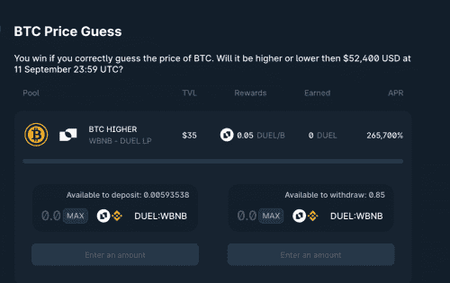

# Duel Network

竞争性农业
Duel Network 是币安智能链上的游戏代币，具有许多令人印象深刻的功能。它是一种游戏代币，您可以在其中玩适合投票的活动，例如政治、金融、州选举，尤其是体育。to
决斗网络最重要的特点是你永远不会输。您将能够通过偏好和投票进入矿池进行耕作，而不会损失您的资金
Duel Network 将允许您第一次玩游戏而不会失去您的资金。多亏了竞争性农业，如果您在比赛中输了，您只会失去双周的奖池奖励。您的 LP 将留在您身边。如果您赢了，其他池的奖励将分配到您的池中。不喜欢的团队/人将有更高的 aprs 和
例如，让我们考虑 2020 年欧洲锦标赛的决赛，两个名为意大利和英格兰的游泳池将以相等的乘数开放。由于系统中没有博彩公司，系统将自然运行。最喜欢球队的 APR 较低，而非最爱球队的 APR 较高。
例如，2组预测比特币每周蜡烛预测在40,000美元上下，主LP基金不会在任何一组中丢失。只有失败者的农场池奖励才会添加到获胜者的农场奖励中。
通过这种方式，也许在世界上第一次，我们将创建一个支付率为 99% 的投票系统。 （每个矿池奖励的 0.5% 将作为开发者费用发送到开发者钱包，0.5% 的奖励将发送到附属钱包。）

