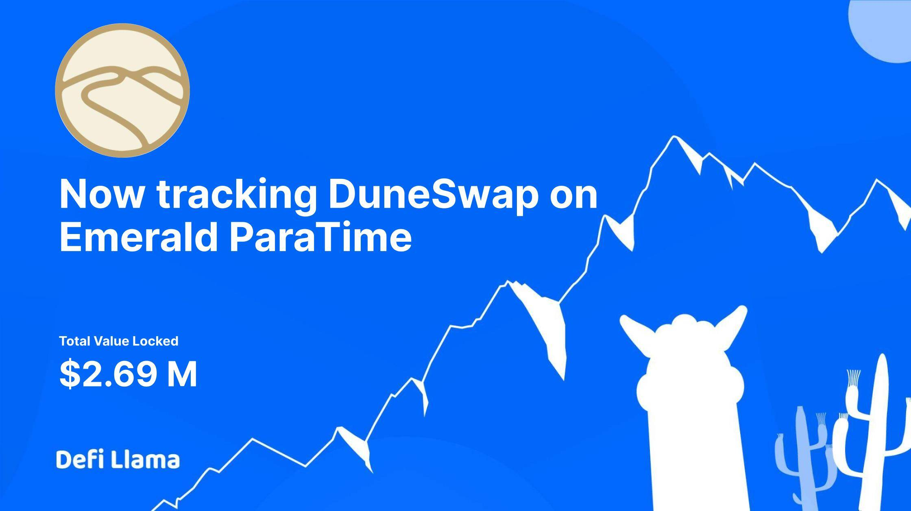

# DuneSwap

Duneswap 是 Oasis Emerald ParaTime 网络原生的自动化做市商/去中心化交易所。 DUNE 是平台的原生代币，可以通过耕种/质押或交易获得。

DUNE 是根据在 Oasis Emerald ParaTime 上通过 Distributor 和/或 Vaults 开采的时间块发出的。没有为投资者、团队或预售预留代币。500k DUNE 的初始供应将与大约 500k DUNE 配对。10k 美元的玫瑰。

Oasis Emerald Paratime 网络处于非常早期的状态，并且不会以一致的方式生成区块，具体取决于活动，因此前端将根据当前平均开采区块的秒数（即 6 秒）进行反映。请记住速率排放量可能会在合理的范围内增加以支持有吸引力的 APY，而沙丘拱顶等机制也可能会抑制循环供应。

