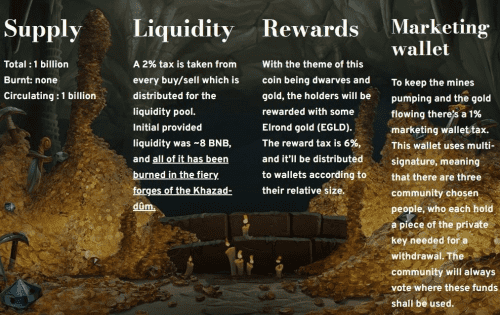

# Dwarfcoin

Dwarfcoin 是一个纯粹由社区驱动的 memecoin，其灵感来自幻想文学中的矮人。它于 2021 年 11 月启动，旨在为加密空间提供一个有趣、新颖且安全的代币。它的主要重点在于可用性和安全性。它被设计为防地毯和社区所有。就像来自幻想世界的矮人一样，矮人币与黄金有着特殊的关系——它在 Elrond (EGLD) 反射中奖励其持有者！
矮人经济学
总供应量：10 亿代币
每笔交易征收 10% 的税
6% 用于 $EGLD 奖励
3% 进入我们的流动资金池
1% 用于营销
反鲸鱼功能：总供应量的最大钱包大小为 2.5%，最大交易大小设置为 1%
合约地址：0xc9ec8d83aff0903745346bc4be1e51c65afa052a

