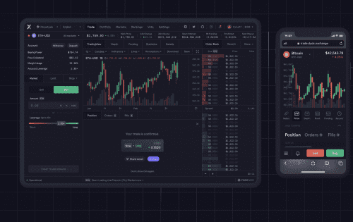

# dYdX

dYdX 是世界领先的保证金和永续交易去中心化平台，构建和民主化去中心化金融的未来。使用 dYdX，用户可以从他们的加密货币、使用自定义杠杆的保证金交易以及在 Layer 2 上以零燃料成本交易永续合约赚取利息。dYdX 是领先的去中心化交易所的开发商，其使命是构建开放、安全和强大的金融产品。 dYdX 在以太坊上经过审计的智能合约上运行，这消除了在交易时信任中央交易所的需要。我们将去中心化交易所的安全性和透明度与中心化交易所的速度和可用性相结合。

