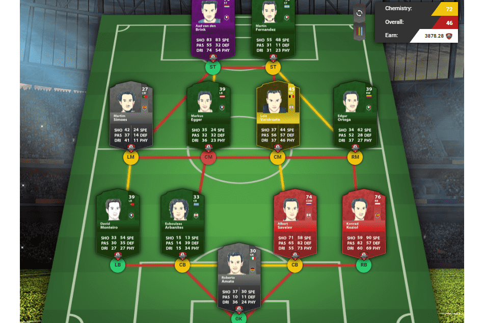

# E-FootballManager

成为真正的足球经理，打造联盟最强球队！购买和出售足球运动员作为 NFT 卡，以打造更好的足球队。投资教练和体育场并获得额外收益！
进入足球世界，成为真正的足球经理，你的俱乐部的命运取决于你。根据您的球员当前的性格为您的球队制定战术，在转会市场上进行交易并参加 SBC（Squad Burn 挑战赛），让您的球队获得另一张独特的 NFT 卡。争取晋级，带领你的团队走向胜利！
转账清单可在最大的 NFT 交易平台 - AtomicHub 上获取，用户可以在其中买卖 NFT 卡。
成为体育场的所有者并组织足球比赛！每天在比赛日和锦标赛期间赚取 20% 的奖金 该游戏将拥有分布在世界各地的 100 个体育场。当前可用的体育场馆列表可以在我们的网站上找到
E-FootballManager Token 基于区块链币安，数量为 5 亿。玩家通过比赛和在市场上交易来赚取代币。 EFM 代币还可用于购买装有足球运动员 NFT 卡的包

