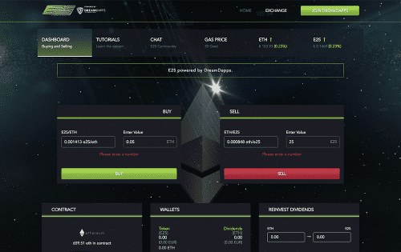

# E25

一个强大的去中心化平台来赚取以太坊。拿着E25赚以太坊，就这么简单。我们正在 E25 之上开发去中心化游戏。如果你有 E25，每次玩游戏你都会收到越来越多的以太坊。由 DreamDapps 提供支持。我们思考这些早期尝试失败的原因，以及其如何以巧妙的吸引和管理流动性机制演变成今日的 Uniswap 协议。我们研究了 Uniswap，其模仿者以及其如何融入 defi 领域。我们通过论证得出结论，大多数去中心化金融（defi）狂热是由不可持续的价格泡沫和激进的通证发行计划产生，从而刺激了投机需求。但是，在这种无法持续的投机狂潮和层层复杂相互关联的 defi 平台之下，我们相信可能有一些技术可以带来一些可持续的发展。

