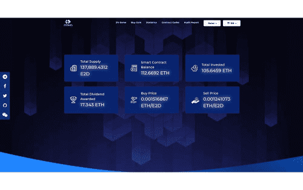

# E2D Game

E2D 游戏是 200eth.com 的交易所，持币者将从游戏量中获得红利，即。 200eth 和交易所本身的交易量。由于买卖与合约本身相互作用，流动性为 100%。购买和出售的每枚代币都会被扣除一个百分比，分配给所有剩余的代币持有者，从而鼓励 E2D 代币的质押。每个代币持有者还将根据代币份额与总铸造代币的份额，从联网游戏（目前是第 200 个游戏）中获得 % 的红利。简而言之，在您购买 E2D 代币的那一刻，您将开始根据您在联网游戏中的份额以及您购买后代币持有者的购买/出售来赚取以太坊。 POWH 3D游戏的一个分支。归功于团队。

